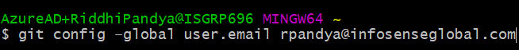

## **Scope**
#### Scope of this document is to provide guideline for end-to-end pipeline to let developer use:
- #### Docker Desktop
- #### Git for source control
- #### Visual Code IDE for development
- #### GitLab for CI/CD

## **Docker Desktop**
### **1. **Install Docker**:**
- #### Use Docker Installation Link -> https://docs.docker.com/get-docker/

### **2. Docker Desktop Installation Steps on Windows**
- #### Double-click Docker Desktop Installer.exe to run the installer.
#### If you haven’t already downloaded the installer (Docker Desktop Installer.exe), you can get it from Docker Hub. It typically downloads to your Downloads folder, or you can run it from the recent downloads bar at the bottom of your web browser.
- #### When prompted, ensure the Enable Hyper-V Windows Features option is selected on the Configuration page.
- #### Follow the instructions on the installation wizard to authorize the installer and proceed with the install.
- #### When the installation is successful, click Close to complete the installation process.
- #### If your admin account is different to your user account, you must add the user to the docker-users group. Run Computer Management as an administrator and navigate to  Local Users and Groups > Groups > docker-users. Right-click to add the user to the group. Log out and log back in for the changes to take effect.

### **3. How To Start Docker Desktop:**
- ####  Docker Desktop does not start automatically after installation. To start Docker Desktop, search for Docker, and select Docker Desktop in the search results.

 
#### When the whale icon in the status bar stays steady, Docker Desktop is up-and-running, and is accessible from any terminal window.

 
#### If the whale icon is hidden in the Notifications area, click the up arrow on the taskbar to show it. To learn more, see Docker Settings.

## **Download & Install Git**

- #### Git Installation  Link: https://git-scm.com/downloads
- #### Press the Download button to install the .exe file

### **Setup**
- #### Run the installer.
- #### Keep everything on default and click next until you see this page.
- #### Tick mark Enable experimental support for pseudo consoles.
- #### Click install to start the installation.

### **Open Git Bash**

- #### On your desktop, Right click and select “**Git Bash Here**”

- #### To Validate successful installation Type “**git --version**”, You should see some output like this

### **Initializing Git (One Time Setup)**
#### After the successful installation, you must initialize the git by providing your name & email so
that Gitlab or any other remote version controlling system knows who you are.

- #### To provide your name write: **git config –global user.name “Your Name”**

- #### To provide your email address write: **git config –global user.email xyz@a.com**

#### NOTE: Make sure your email is authorized to make commits to IsgGroup group. If you
have any “you are not authorized to push commits to this repository” conflicts, then
ask Bhavin Mehta to authorize your email.

## **Download & Install VS Code**

- #### Visual Studio Code Installation Link: https://code.visualstudio.com/

### **Install below Extension in VS code for GitLab and VS code Integration**

- #### GitLab Workflow
- #### GitLab VS Code Extension
- #### GitLens — Git supercharged

## **Steps to clone the project in our system**

### **Step 1: Create New Directory**

- #### Create Directory to store all git repositories. I have created GIT Repository named folder.

### **Step 2:  Cloning a Repository**

- #### Login in GitLab. GitLab Link: https://gitlab.com/
- #### Go to Repository which we want to clone.
- #### Press the clone button and then copy the https link.

### **Step 3:  Cloning a Repository in Our System**

- #### Open VS code
- #### Click on Clone Repository 

- #### Paste https link which we have copied while Cloning and Press Enter

- #### Select Repository Location, we have created earlier to store GIT Repository(eg.GIT Repository)

- #### GIT Repositories is stored into the selected Repository Location(eg.GIT Repository) 
- #### In VS code, Open the folder (e.g.end-to-end-p1) which we have cloned in selected Repository Location(eg.GIT Repository) 

- #### Now VS code folder structure look like this:

## **Run Code**

- #### To Run the code, Make sure your docker-desktop is running(refer.. How To Start Docker Desktop in Docker Desktop Topic) 
- #### right click on docker-compose.yml. and select compose-up

#### After successfully container running: 
- #### Click on Docker Extension in VS code
- #### Expand the Container(eg.end-to-end-p1)
- #### right click on Image(which we wanted to Run e.g end-to-end-p1_angular_1) and select **Open in Browser**

## **Stop Code**

- #### right click on docker-compose.yml.and select compose-down

