

[[_TOC_]]

### About this document:

This is a quick blog-style document that will list **11** useful **VS Code Extensions** that will make your life a bit easier. :rocket:      

To **download** any of these _extensions_ just go to the **Extensions** tab (_**4 box symbol** in the leftmost tab_) in VS Code and Search their name.  

I have divided this document into 2 sections:

1. **Must Haves**: Extensions that I think everyone should have.
2. **Useful Ones**: Not necessary; I like them, you may like them too! 

> **Note**: **(recommended) The Word Document** for the same can be accessed from [here](uploads/d400b8495879334d89c2bb09f44d3496/Extensions_for_Working_More_Efficiently_with_VS_Code.docx)! It contains additional **gifs** which aren't possible on the gitlab.

## **Must-Haves**

### 1. _PyLance_:

This is a **powerful** python extension that **supercharges** your basic VS Code _IntelliSense_. It greatly **enhances** your coding **speed & efficiency**. Here are some of the features Pylance provides,

- Parameter suggestions
- Code completion
- **Auto-imports** (as well as add and remove import code actions)
- **As-you-type reporting of code errors and warnings** (diagnostics)
- Code outline
- Code navigation
- **Type checking mode**
- IntelliCode compatibility
- **Jupyter Notebooks compatibility**
- Semantic highlighting

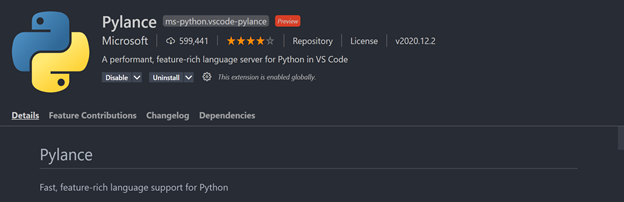

### 2. _Indent Rainbow_:

A simple thing but **saves minutes of debugging**. Inserts a **color** before **every indentation** making it nearly **_impossible_** to wrongly indent something.

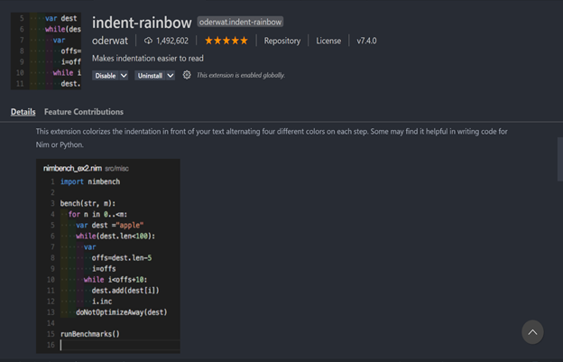

### 3. _Code Spell Checker_:

Checks the code for **spelling mistakes** in **live time**. Really helpful while _writing comments_ or defining a _function/variable name_.

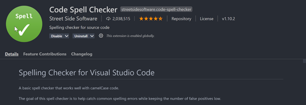

### 4. _Path IntelliSense_:

Sometimes we get that **cumbersome path error** and then we spend the next 10-15 minutes figuring out the **_correct path_**. This extension is the **solution** to this problem. It **keeps track** of all the _directories_ and **auto-suggests folders** stored on that path as soon as you _start writing_ the path.

    Just type “ ./ ” and it will start suggesting paths.

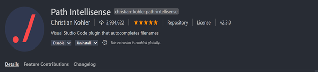

### 5. _GitLens_:

**One Stop solution** for all **git** related needs.

GitLens simply helps you **better understand code**. Quickly glimpse into **_whom_, _why_, and _when_ a line or code block was changed**. Jump back through **history** to gain further insights as to **how and why the code evolved**. Effortlessly explore the history and evolution of a codebase.

- GitLens **supercharges** the Git capabilities built into Visual Studio Code. 
- It helps you to **visualize code authorship** at a glance via Git blame annotations and code lens.

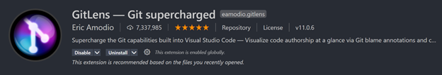  
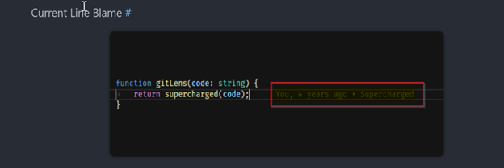  
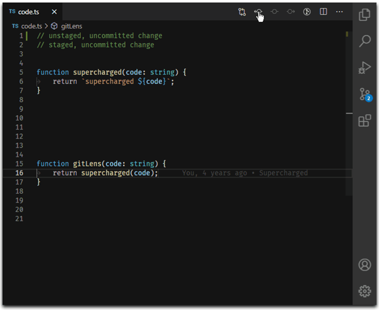

There are a lot more functionalities than what I have written, make sure to check the **extension description** for more details.
 

## **Useful Ones**

### 1. _Python Indent_:
     
Makes the _**cursor** stand where it should be_. **Intelligent** cursor **placement** tailored for python to **increase coding speed**.

### 2. _Better Comments_:

- **Different comment colors** can help _distinguishing normal comments_ from _special comments_. 
- Also, we can assign **different colors for different messages** like Important, Note, Todo, Pay attention, etc.
- To use, Just add a **specified symbol** before the comment. Ex. !,?,*, etc.

  
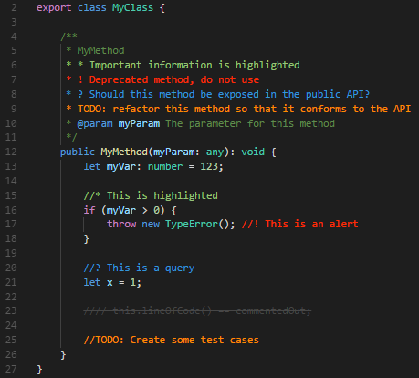

### 3. _TODO TREE_:

- Keep **all your “Todo”s in a single place**.
- Imagine you are reviewing a code of your teammate and you **notice some error**, now instead of trying to remember it Just add a **“TODO” comment there**.
- This will automatically get **stored in a TODO tab** in VS Code.
- Now next time you want to see all the TODOs just go to the TODO tab.
- This is the best way to **keep track** of all your _**unfinished tasks**_.

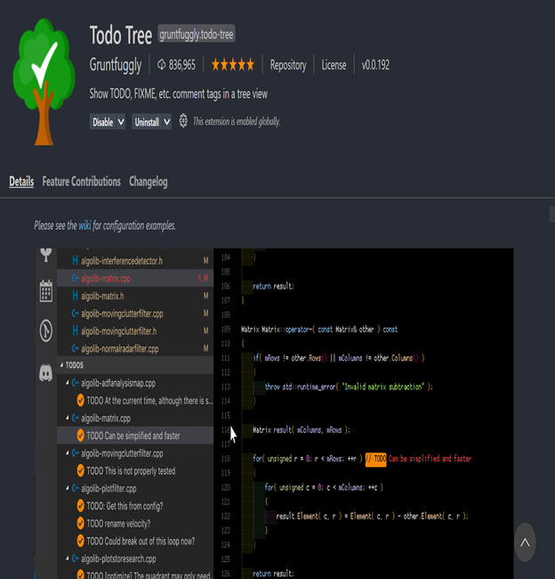

### 4. _EDIT CSV_:

Edit CSVs in an **Excel** kind of **UI** _inside of **VS Code**_. Useful for quickly editing CSVs.

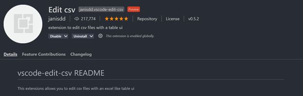

### 5. _File Icons_:

The larger the project, the messier the file structure looks. **File Icons Extension** gives *each directory & file an __icon__* so that we can easily identify the **file type and directory structure**.

  

### 6. _Stack Overflow View_:

And here comes, **whole stack overflow inside of VS Code**.  
After installation, Press `**Ctrl + Alt + s**` to open a **search box**, and then **enter your search query**. The **results** will be _displayed inside_ of the **VS Code** itself.

### 7. _Bracket Pair Colorizer_:

**Colorizes matching pair of brackets**, so you can now easily _identify **missing brackets**_.

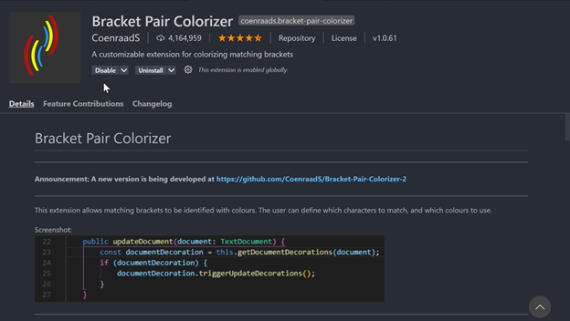