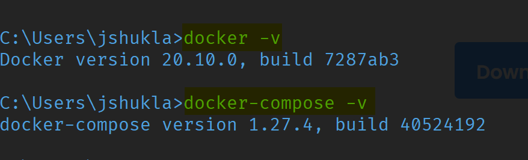
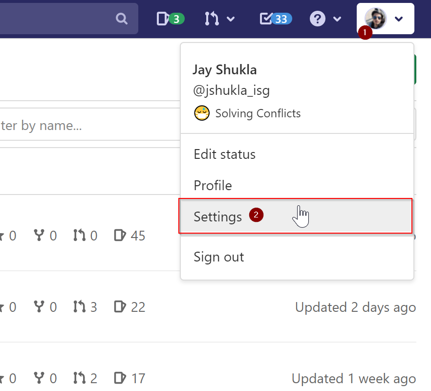
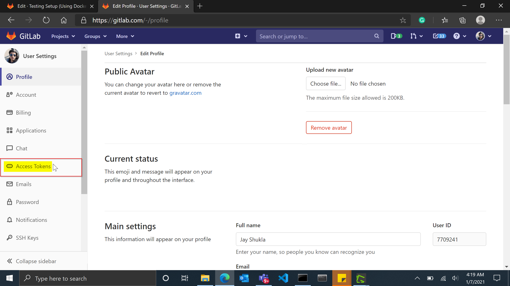
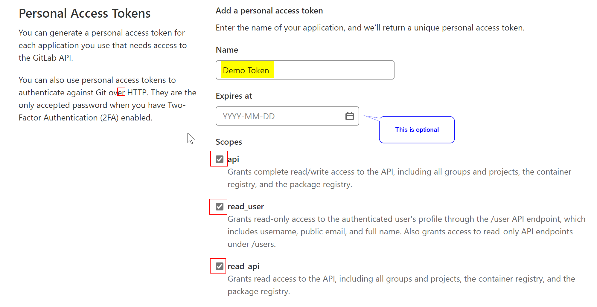
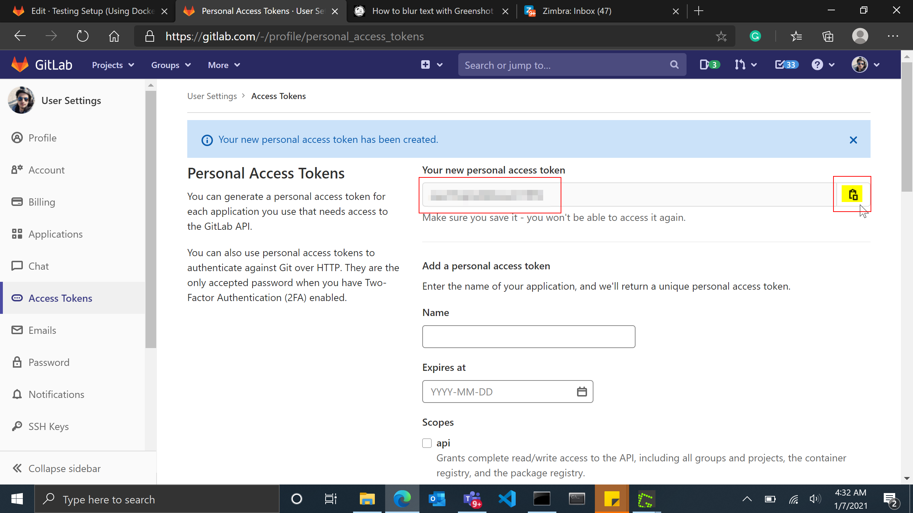
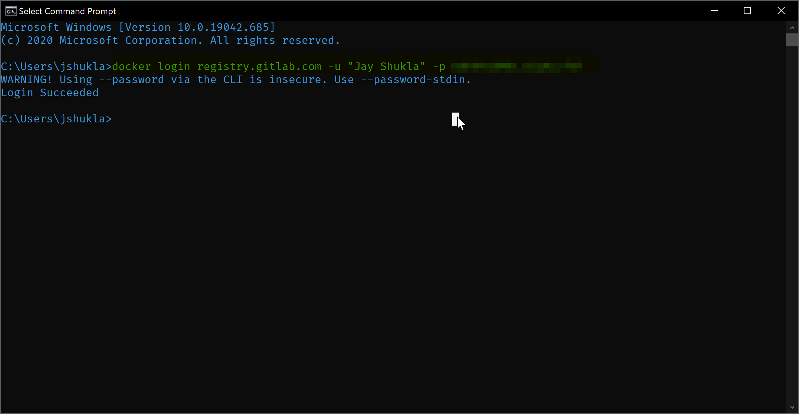

This Documentation will explain how to create **containers** from the _latest images_ **stored in this repository**. Which can be used to perform acceptance testing.

[[_TOC_]]

### _Requirements:_

- [docker-desktop](https://www.docker.com/products/docker-desktop)
- docker-compose
- ~ 800Mb of Data for image download

# Before Getting Started

These steps will be performed **only once** when you are testing for the **first time**. **Skip** this section if you have **already followed** it once before.

### 1) Check for working docker & docker-compose installations in your machine  

Open up a **terminal** & write the below commands,

- **testing docker installation**  
```bash
docker -v 
```
> **Output**: Docker version 20.10.0, build 7287ab3

- **testing docker-compose installation**  
```bash
docker-compose -v
```
> **Output**: docker-compose version 1.27.4, build 40524192



If you don't see the **version** in any of the outputs then the **Docker/docker-compose** is currently **not installed** on your pc. They have to be [installed](https://www.docker.com/products/docker-desktop) to proceed further with the **Testing Setup** documentation. 

### 2) Create a Personal Access Token in Gitlab

A **Personal Access Token (PAT)** will be required to **pull** or **push** any **_docker image_** to the **Gitlab Registry**.  

**_Steps to generate a PAT:_**

1. Go to the [https://gitlab.com/](https://gitlab.com/).  
2. Go to the **Settings** Menu.


<hr>

3. Go to the **Access Token** tab from the **Navigation bar**.



4. Provide a **Name** for the **PAT** & **Check** all the **Checkboxes**.



5. Press the green **Create Personal Access Token** button to generate a PAT. **Make Sure** to **store it somewhere** for later use.



### 3) Login to Gitlab Registry

- Open up the **Terminal** & type the following _command_,  
```bash
docker login registry.gitlab.com -u "user_name" -p "Access Token"
```
> **Note:** you can find the **user_name** in the top-right dropdown, it will be something like **@your_name**. **Make sure** to exclude **'@'** from the user name in the above command.



Once the login **succeeds**, you are ready to move to the next section.
  
If you are having some trouble with the **login** then contact someone from the project's **Docker** or **Gitlab** team.

# How To get the Containers running in your Machine

### 1) Download this file anywhere on your machine:

(right-click the below file & select the "**save link as**" option, make sure you keep the filename as **docker-compose.yml**)

[docker-compose.yml](uploads/99c9293e2f392c675282a4ba82278dd3/docker-compose.yml)
### 2) Open your terminal & go to the directory where this file is stored

```bash
cd Path/to/the/Directory
```

### 3) Compose up the file

You will need to perform the _**compose up**_ to build the _containers_ in your machine. Write the following _command_ in the **terminal**:

```batch
docker-compose down && docker volume prune -f && docker-compose pull && docker-compose up
```

Wait _(~5 mins)_ till the **containers** get built **automatically** & that's it! Now the **containers** are running in your localhost. So now you can proceed with the tests.

# Testing the Images

If the containers are **successfully** running in your machine then there will be **two** servers running on below ports,

| Server | Port | Url |
| ------ | ------ | ----- |
| **Django Server** (REST) | 8000 | [http://localhost:8000](http://localhost:8000) |
| **Angular Server** (Website) | 4200 | [http://localhost:4200/account/login?returnUrl=%2Fproject](http://localhost:4200/account/login?returnUrl=%2Fproject) |

Login Credentials:

| Username| Password|
| ------ | ------ |
| raj| raj|
| mehul| mehul|
| swati| swati|
| bhavin| bhavin|
| vipul| vipul|
| riddhi| riddhi|
| jay| jay|
| abhishek| abhishek|
| shivani| shivani|
| mansi| mansi|
| shivani| shivani|
| nisha| nisha|


The **Website** takes additional **5 minutes** to start.  After that, you can directly go to the [http://localhost:4200/account/login?returnUrl=%2Fproject](http://localhost:4200/account/login?returnUrl=%2Fproject) to view the website.

To test the **REST Server** you may use the **Postman** software to send **API Requests** to the server.