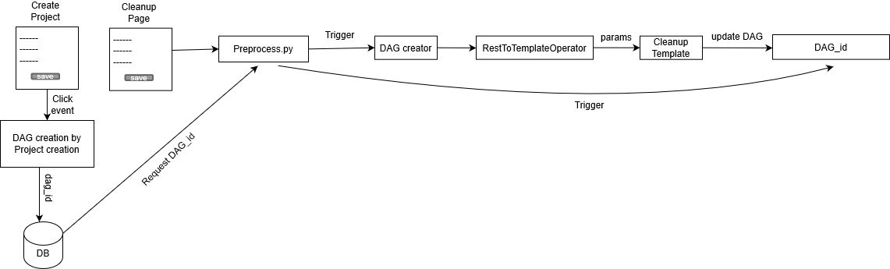

This document will guide you in creating **dynamic dags** for your special dag needs.

[[_TOC_]]

# What is a Dynamic Dag?

- Dynamic Dag is a dynamically generated python (dag) file that is built in such a way that all it has to do is to just run.  
- It **will not** require any external calls for the parameters because all the required parameters will be **embedded** into it at the **build time**.

## When to use the Dynamic Dags?

- When you want to access some parameter **OUTSIDE** of a task.  

**Examples:**
- Want to use **project_id** outside of a task.
- Trying to get some parameters that will eventually dynamically define new tasks. (You have to be **outside** of the tasks to create new tasks!)
  
## How to use dynamic DAGs

### Step 1 : Create a .template file 

The First step of the procedure will be to create a **.template** file in the `MS/mlaas/commom/dynamic_dags/templates/`.

The Template **must** contain two things,
- **#DAG_ID** : For giving dynamic dag_id.
- **#MASTER_DICT** : For passing all the required parameters.

**Example :**
```python
main_dag_id = #DAG_ID

args = {
    'owner': 'airflow',
    'start_date': airflow.utils.dates.days_ago(1),      
    'provide_context': True, 
}

dag = DAG(
    main_dag_id,
    default_args=args,    
    description='A Dynamically Generated DAG.',
    catchup=False,
    schedule_interval = '@once',                         
)

#? Getting Required Parameters

master_dict = #MASTER_DICT 

operation = master_dict['operation_dict']
value_dict = master_dict['values_dict']
schema_id = int(master_dict['schema_id'])
dataset_id = int(master_dict['dataset_id'])

```
The above code will be replaced by the below code once you run the dag_creator DAG.

```python

main_dag_id = "Cleanup_dag_138352851250384220"

args = {
    'owner': 'airflow',
    'start_date': airflow.utils.dates.days_ago(1),      
    'provide_context': True, 
}

dag = DAG(
    main_dag_id,
    default_args=args,    
    description='A Dynamically Generated DAG.',
    catchup=False,
    schedule_interval = '@once',                         
)

#? Getting Required Parameters

master_dict = {'operation_dict': {22: [4]}, 'values_dict': {22: ['']}, 'schema_id': '1', 'dataset_id': '6'} 

operation = master_dict['operation_dict']
value_dict = master_dict['values_dict']
schema_id = int(master_dict['schema_id'])
dataset_id = int(master_dict['dataset_id'])

```

as you can see above a dag_id gets allocated to the dag in place of **#DAG_ID**.

Also, the **#MASTER_DICT** gets replaced by the dictionary we will be sending in the request.

> NOTE: Make sure we are sending all the required Parameters in the Master dict in the post request.

### Step 2 : Call the DAG creator

After creating a Template we will have to call a DAG that creates a python file from an above-defined template.

to call this DAG we must first create the JSON data required for the request body.

The JSON will contain the below parameters.

1. **master_dict**: For sending all your required parameters.
2. **dag_id**: For sending the id of the Dag. (Which will replace the #DAG_ID placeholder)
3. **template**: Name of your template. _**Example:** cleanupdag.template_
4. **namespace**: Name of the folder in which all of your dags will be stored. (This folder will be created inside of the **mlaas/dynamic_dags/** folder.)

> **NOTE:** The JSON should be sent through the **POST** request.

Below is a code snippet of how we will create us a json request,

```python

import requests
import uuid
impoer json

# Creating a Unique Dag ID, we CAN'T have two dags with the same dag_id 
id = uuid.uuid1().time
dag_id='Cleanup_dag_'+str(id)
    
# Template that should be used
template = "cleanup_dag.template"

# Name of the folder
namespace = "Cleanup_Dags"
        
# Master Dict
master_dict = {
        "operation_dict": {},
        "values_dict": {},
        "schema_id": schema_id,
        "dataset_id": dataset_id,
        "project_id": project_id
        }
 
# Creating the json data for the POST request       
json_data = {'conf':'{"master_dict":"'+ str(master_dict)+'","dag_id":"'+ str(dag_id)+'","template":"'+ template+'","namespace":"'+ namespace+'"}'}

# Calling the dag_creator (Sending the POST Request)        
result = requests.post("http://airflow:8080/api/experimental/dags/dag_creator/dag_runs",data=json.dumps(json_data),verify=False)#owner
        
```

And That's it! This POST request will basically create a **new dag** from **your given template** with **your given parameters**.  

The Dynamically created Dag will also start running once it gets detected. 

# Mlaas's Dynamic Dag Workflow





In the Mlaas project, a DAG for your need gets generated at the time of project creation. If it's not getting created then _add a column in the **project_tbl**_ for your need & _chain a function that returns unique_dag_id_ for your project.

### Creating & Storing the DAG

The below function snippet returns a unique dag_id for the cleanup_dags which will be stored in the project_tbl.

```python

import uuid
import json
import requests

def get_cleanup_dag_name(self):
        id = uuid.uuid1().time
        dag_id='Cleanup_dag_'+str(id)

        template = "cleanup_dag.template"
        namespace = "Cleanup_Dags"
        
        # Sending an empty master dict because we don't want to run the dag right now.
        # We just want to initialize the dag. 
        master_dict = {}
        
        json_data = {'conf':'{"master_dict":"'+ str(master_dict)+'","dag_id":"'+ str(dag_id)+'","template":"'+ template+'","namespace":"'+ namespace+'"}'}
        
        result = requests.post("http://airflow:8080/api/experimental/dags/dag_creator/dag_runs",data=json.dumps(json_data),verify=False)#owner

        # This dag_id will be stored in the project table.
        return dag_id

```

Just chain some function like above when the row is getting inserted into the project_tbl.

**Example:**
```python

# IN ingest.utils.project.project_creation.py file

    def make_project_schema(self):
        """This function is used to make a schema for creating project table.
           E.g. column_name  data_type.

        Returns:
            [string]: [it will return name of the table, structure of the table and columns of the table.]
        """
        logging.info("data ingestion : ProjectClass : make_project_schema : execution start")
        # Project table name
        table_name = 'mlaas.project_tbl'
        
        # Columns for project table
        # -------> HERE ADD YOUR COLUMN NAME IN THE COLS STRING
        cols = 'project_name,project_desc,user_name,original_dataset_id,dataset_id,cleanup_dag_id' 
        # Schema for project table.
        # -------> HERE ADD YOUR COLUMN NAME IN THE SCHEMA
        schema ="project_id bigserial,"\
                "project_name  text,"\
                "project_desc  text,"\
                "dataset_status integer NOT NULL DEFAULT -1,"\
                "model_status integer NOT NULL DEFAULT -1,"\
                "deployment_status integer NOT NULL DEFAULT -1,"\
                "user_name  text,"\
                "original_dataset_id  bigint,"\
                "dataset_id bigint,"\
                "schema_id bigserial,"\
                "cleanup_dag_id text,"\
                "model_dag_id text,"\
                "input_features text,"\
                "target_features text,"\
                "scaled_split_parameters text ,"\
                "problem_type text,"\
                "created_on TIMESTAMPTZ NOT NULL DEFAULT NOW()" 
                
        logging.info("data ingestion : ProjectClass : make_project_schema : execution end")
        return table_name,schema,cols

    def  make_project_records(self,project_name,project_desc,user_name,original_dataset_id,dataset_id):
        """This function is used to make records for inserting data into project table.
           E.g. column_name_1,column_name_2 .......,column_name_n.

        Args:
            project_name ([string]): [name of the project.],
            project_desc ([string]): [descriptions of the project.],
            user_name ([string]): [name of the user.],
            original_dataset_id ([integer]): [dataset id of the created dataset.]

        Returns:
            [tuple]: [it will return records in the form of tuple.]
        """
        logging.info("data ingestion : ProjectClass : make_project_records : execution start")
        
        # ------> HERE CHAIN YOUR FUNCTION
        cleanup_dag_id = preprocessObj.get_cleanup_dag_name()
        
        # ------> ADD YOUR PARAMETER IN THE BELOW ROW
        row = project_name,project_desc,user_name,original_dataset_id,dataset_id,cleanup_dag_id
        row_tuples = [tuple(row)] # Make record for project table.
        logging.info("data ingestion : ProjectClass : make_project_records : execution end")
        return row_tuples
        
```

As we can see in the example, I've added the **_cleanup_dag_id_** column in the schema & made the necessary function call at the time of **insertion** to get the **dag_id**.

Doing the above procedure will make you a new _Dynamic Dag_ & will store its _dag_id_ in the _project_tbl_.

### Triggering the Dynamically Created DAG

Now, when you want to trigger(run) this dynamically created file, you will have to,

1. **Fetch the dag_id** from the project table 
2. Rerun the **_dag_creator_** with new parameters to **update** your dag.
3. Trigger the dynamically created dag.

Below code snippet does all that work,

```python

    def dag_executor(self,project_id, dataset_id, schema_id, request):
        
        logging.info("data preprocessing : PreprocessingClass : dag_executor : execution start")
        
        DBObject,connection,connection_string = self.get_db_connection()
        if connection == None :
            raise DatabaseConnectionFailed(500)
         
        # ------> FATCHING THE DAG_ID FROM THE PROJECT TABLE   
        sql_command = f"select pt.cleanup_dag_id from mlaas.project_tbl pt where pt.project_id = '{project_id}'"
        dag_id_df = DBObject.select_records(connection,sql_command) 
        dag_id = dag_id_df['cleanup_dag_id'][0]
        
        op_dict, val_dict = self.reorder_operations(request)
        
        template = "cleanup_dag.template"
        namespace = "Cleanup_Dags"
        
        # ------> REBUILDING THE MASTER DICT WITH YOUR REQUIRED PARAMETERS
        master_dict = {
        "operation_dict": op_dict,
        "values_dict": val_dict,
        "schema_id": schema_id,
        "dataset_id": dataset_id,
        "project_id": project_id
        }
        
        # ------> MAKING THE NEW JSON DATA TO BE SENT
        json_data = {'conf':'{"master_dict":"'+ str(master_dict)+'","dag_id":"'+ str(dag_id)+'","template":"'+ template+'","namespace":"'+ namespace+'"}'}
        
        # ------> TRIGGERING THE DAG_CREATOR DAG TO UPDATE THE DYNAMICALLY CREATED DAG
        result = requests.post("http://airflow:8080/api/experimental/dags/dag_creator/dag_runs",data=json.dumps(json_data),verify=False)#owner
        
        # ------> TRIGGERING THE DYNAMICALLY CREATED DAG SO THAT IT CAN RUN WITH THE NEWLY UPDATED PARAMETERS
        json_data = {}
        result = requests.post(f"http://airflow:8080/api/experimental/dags/{dag_id}/dag_runs",data=json.dumps(json_data),verify=False)#owner
        
        logging.info("DAG RUN RESULT: "+str(result))
        
        logging.info("data preprocessing : PreprocessingClass : dag_executor : execution stop")
            
        return 0

```
The above code will successfully update & run the stored dag with **newly specified parameters.**

& this is all you need to know to implement the functionality of **_dynamic dags_** in your module!!