<hr>

[[_TOC_]]

### About this document:<hr>

This documentation will give you a **detailed tutorial** about how to efficiently work with **git** & **Gitlab** on daily basis as a Developer, even if you do not know anything about version controlling.

**So, let’s get started!**

> **Note:** You can **download** the **PDF** version of this document from [here](uploads/7a7e42d0b3992e457fa202f7bc3c98d0/MLaaS_Working_with_Gitlab.pdf)!

## Before we begin

Before we start working with Gitlab, let's **make sure** that we have **git** running on our _machine_. Open your **command prompt** and type,

```powershell
git --version
```

If it shows the git version then you are good to skip the Installation step, else follow the installation step to get git running on your machine.

## Installing Git (One Time Setup)

#### _Step - 1: Downloading Git_

1. Go to [this website](https://git-scm.com/).  
2. You will see a screen similar to this.  
3. Press the Download button to install the .exe file.

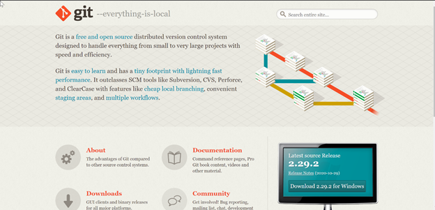

#### _Step - 2: Setup_

1. Now, simply run the installer.  
2. Keep everything on default and click next until you see this page.  
3. Tick mark **Enable experimental support for pseudo consoles**.  
4. Click Install to start the installation.  

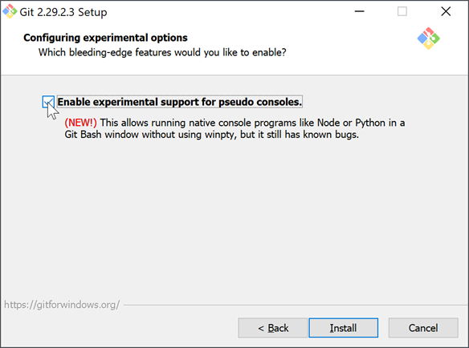  

## Confirming the Installation

#### _Step - 1: Open Git bash_ 

- On your desktop, **Right Click** and select "**Git Bash Here**"

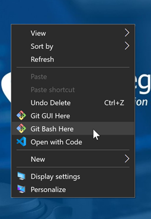

#### _Step - 2: Confirming_

- Type “**`git --version`**”, You should see some output like this.

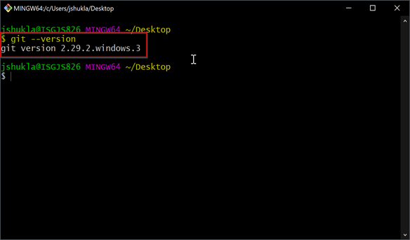

## Initializing Git (One Time Setup)

After the successful installation, you must initialize the **git** by providing your **name & email** so that **Gitlab** or any other _**remote** version controlling system_ knows who you are. 

- To provide your name write,

```batch
git config –-global user.name “Your Name”
```

- To provide your email address write,

```batch
git config –-global user.email yname@xyz.net
```

**NOTE**: Make sure your email is **authorized** to make commits to **IsgGroup**. If you have any “**you are not authorized to push commits to this repository**” conflicts, then ask Bhavin Mehta to authorize your email.

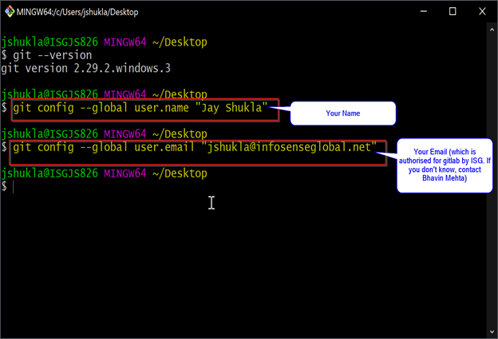

## Importing (Cloning) a Remote Project In your PC

#### _Step - 1: Create New Directory_

- This step is **not necessary** but it’s good to have some folder where all your git repositories will be stored.  
- I usually have a folder named **Gitlab Repos** in my PC where I clone all my repositories.


#### _Step - 2: Cloning a Repository_

Usually, all our code is stored in a **remote repository**, so first we have to import the code into our pc, this process is called **Cloning a project** and it happens (hopefully!) only one time.

I have created a **practice repository** where you can practice all the things.

- Go to [this link](https://gitlab.com/isgtest/demo_project_for_newbies).  
- Press the clone button and then copy the https link.

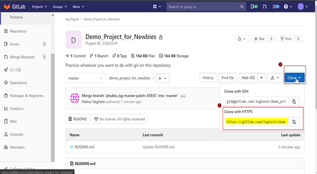

#### _Step - 3: Open Git Bash_

- Navigate to the “Gitlab Repos” folder we created earlier (or to any place where you want to store your repo)  
- Right click and open git bash  

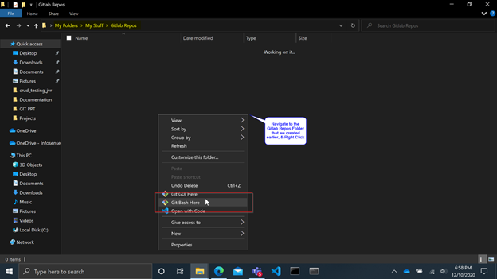  
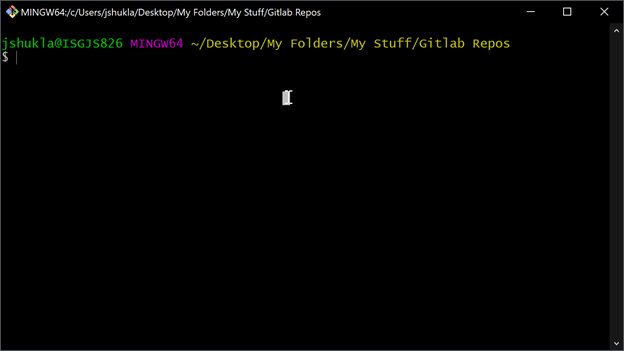

#### _Step - 4: Clone the Repo_

- Type “**`git clone https_link_you_copied`**” and press enter, a new Repository will be created.  
- Now you can open that repository in your **vs code**.  

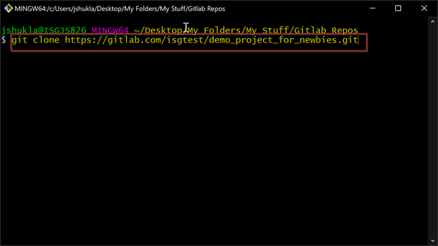  
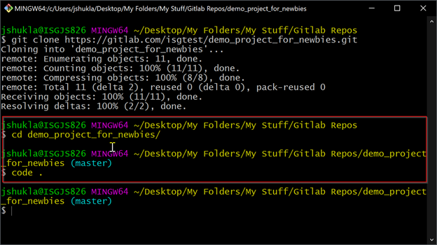

## Day-to-Day Workflow

This is the most important section of this tutorial and you will encounter these tasks on a daily basis. So, let’s get started.

#### _Step - 0: Pull the Development Branch_  

- **Remember before doing anything always do a pull**. Press the **3rd button** in the below figure's **dropdown**.

#### _Step – 1: Creating a Branch IF IT NOT ALREADY EXISTS_

- **If The Branch With Your Name Does Not Exist** Then, First You Will Need To **Create A Branch Of Your Name** Before Making Changes To the Repository.  
- To create a new branch, follow the steps sown in the below figure.

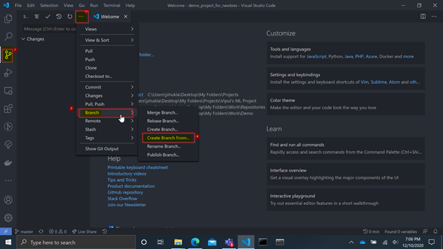  
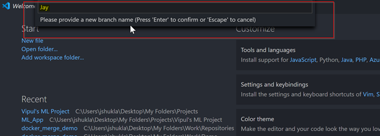  

- Select **Developer** Branch. (You are creating a branch from the Developer branch, so you will have a **copy** of all the files in the Developer branch so that whenever you make **changes** in **your branch** the _Developer branch stays unchanged_.)

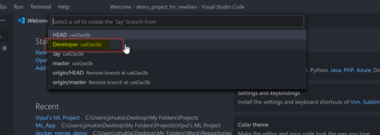

- Then now get into (**Checkout to**) the branch that you just created, to **make changes** in that branch.

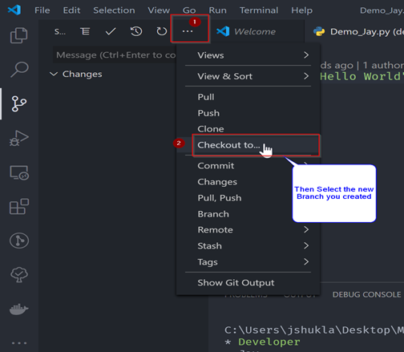

**NOTE**: In case you want to see _how many branches_ are there then press,

~~~
CTRL+SHIFT+ `
~~~

 to open a terminal and then type,

```bash
git branch
``` 

#### _Step - 2: Edit the Files_

Now that you are in your branch, you are free to make whatever changes you want to make in the repository.

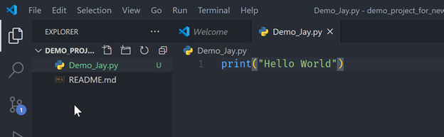

#### _Step - 3: Staging and Committing the Changes_

- Follow the steps shown in below figure to **stage and commit** your changes.  
- **NOTE**: If some **pop-up** tells you that “**The changes are not staged, stage & commit them directly?**” then press “**Yes, Always**”  
- Finally Type the commit message in the pop-up, this will be the **name of your commit**.    

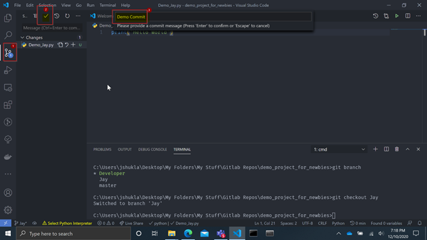

#### _Step - 4: Push Changes to the Remote Repository_

Now that the changes are _securely stored_ in your local machine, we would like to **push the changes** to the **remote repository** so that your Team can see them. 

- Follow the steps shown in below figures to push your changes to the remote repository.  
- **NOTE: If Some conflict happens here then you will have to pull the Developer branch and then push again. Just open terminal and type**, 

```batch
git pull origin branch_name
```

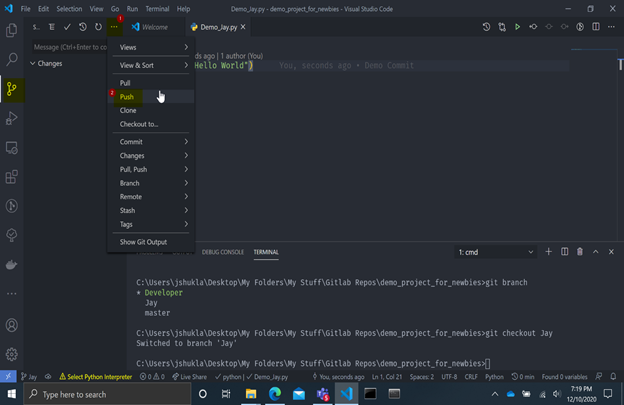  
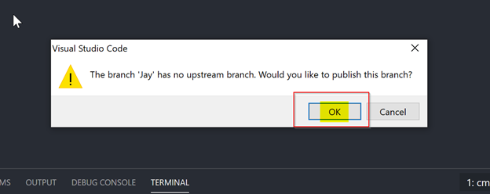  

#### _Step - 5: Making Changes Again_

If you want to make some changes **again**, then **You Don’t Have to Create a New Branch Now**. Just make the changes again and **repeat steps 0,3 & 4** to _**commit and push**_ new changes.

#### _Step - 6: Merge your Changes in Developer branch_

You will need to **merge** your Named branch into the Development branch to merge your changes with the changes done by your team.

- Go to the Gitlab Repository.
- Follow Below Steps to Create a merge request.

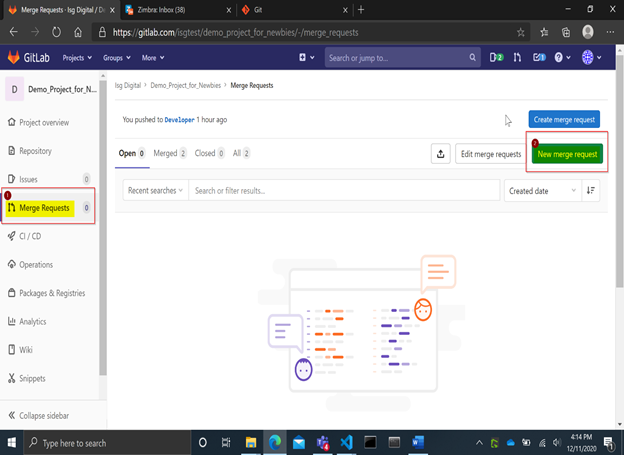  

- Then on the next page they will ask you to **select branches**.  
- In our case, the source branch will be **your branch** and the target branch will be the **Developer** branch.  
- **Carefully Select Developer as A target branch, If you don’t see a developer branch then that branch must have been deleted. In that case, contact someone who is handling the Gitlab Project.**  

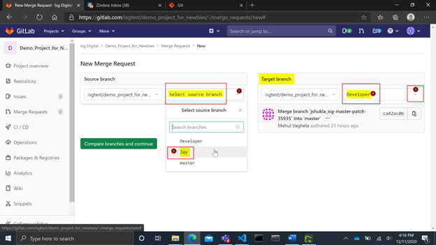

- Now on the next page, simply press **Submit merge request.**

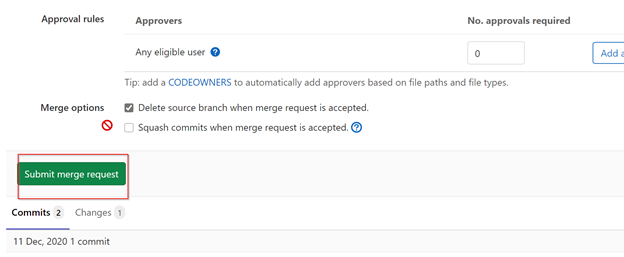

**Congrats**, now you know everything you need to know for working with Gitlab!